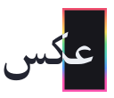

<h1 align="center">
    
</h1>

A relatively high contrast theme, with more saturated & playful colours that try to strike a balance between aesthetics and usability.

### Acknowledgements

This theme was inspired by several others, notably:
- [Catpuccin](https://github.com/catppuccin/catppuccin);
- [OneDark](https://github.com/joshdick/onedark.vim);
- [TokyoNight](https://github.com/folke/tokyonight.nvim);
- [Nord](https://www.nordtheme.com/).

Tools used:
- [themer.dev](https://themer.dev/)
  - [themer.dev link for aks](https://themer.dev/?calculateIntermediaryShades.dark=false&calculateIntermediaryShades.light=false&activeColorSet=dark&colors.dark.shade0=%2317171C&colors.dark.shade1=%23222430&colors.dark.shade2=%233E4856&colors.dark.shade3=%235B697B&colors.dark.shade4=%23CBD1EC&colors.dark.shade5=%23DADEF1&colors.dark.shade6=%23E5E9F0&colors.dark.shade7=%23ECEFF4&colors.dark.accent0=%23EF476F&colors.dark.accent1=%23FE995E&colors.dark.accent2=%23FADD5C&colors.dark.accent3=%2366DB8D&colors.dark.accent4=%234ECDC4&colors.dark.accent5=%235596F7&colors.dark.accent6=%23FC56B1&colors.dark.accent7=%23A972FF&colors.light.shade0=%23F2F4F7&colors.light.shade1=%23E2E6F7&colors.light.shade2=%23CBD1EC&colors.light.shade3=%23ABB3CA&colors.light.shade4=%235B697B&colors.light.shade5=%233E4856&colors.light.shade6=%23222430&colors.light.shade7=%2317171C&colors.light.accent0=%23FF1D4E&colors.light.accent1=%23FC8E4E&colors.light.accent2=%23E1B900&colors.light.accent3=%2300D948&colors.light.accent4=%2300C2C2&colors.light.accent5=%230066FF&colors.light.accent6=%23FF0099&colors.light.accent7=%238F00FF)
- [coolors.co](https://coolors.co/)

### License

[MIT](/LICENSE)

